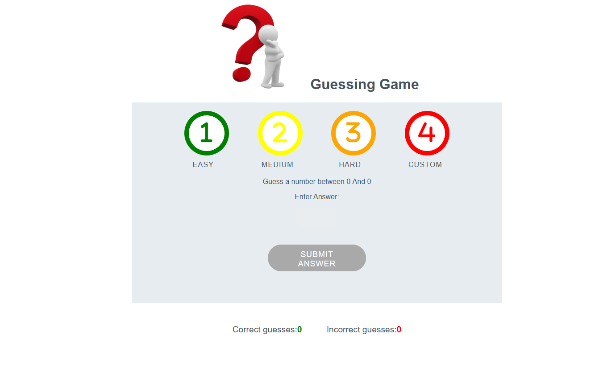

# 🎯 Guessing Game

A simple and fun number guessing game built with HTML, CSS, and JavaScript.
Players can choose a difficulty level — Easy, Medium, Hard, or Custom — and try to guess a randomly generated number.
Hints guide players toward the correct answer while tracking correct and incorrect guesses.

# Table of Contents

1. [Features](#features)  
2. [Project Structure](#project-structure)  
3. [How to play](#how-to-play)  
4. [Technology used](#technologies-used)  
5. [Preview](#preview)  
6. [Validation Testing](#validation-testing)  
7. [Deployment](#deployment)  
8. [Accessibility](#accessibility)
9. [Credits](#credits)  

# Features

🎚️ Multiple difficulty levels:

This feature allows players of all skill levels to find a suitable challenge, ensuring the game is always engaging and accessible.

- Easy: Guess a number between 1–5

- Medium: Guess a number between 1–15

- Hard: Guess a number between 1–25

- Custom: Set your own maximum number

# Interactive hints

 The interactive hints provide real-time, actionable feedback based on the difference between the guess and the target number. This helps users develop a logical approach to quickly narrow the range of guesses.

- 🔥 Super close! (±2)

- 🌡️ Warm! (±5)

- 🧊 Cold! (±10)

- 🥶 Very cold! (more than ±10)

# Score tracking:

The game keeps a running score of your attempts, which motivates players by showing their immediate progress and number of attempts. This encourages them to beat their personal best or try to win in fewer guesses next time.

 ✅ Correct guesses

 ❌ Incorrect guesses
 

# Responsive design

The application adapts seamlessly to all screen sizes (desktop, tablet, and mobile). This ensures the game is accessible and fully playable on any device, so you can enjoy it anywhere without loss of functionality.

# Project Structure

Guessing game
  - index.html 
  - assets
    - CSS
      - styles.css
    - js
      - scripts.js
    - images
      - Qmark-pic.png
      - guessing-game-pic.png 
      - project 2 css snip.png
      
  - README.md

# How to Play

Open index.html in your web browser.

Choose a difficulty level — Easy, Medium, Hard, or Custom.(G)

Enter your guess in the input box.

Click "Submit Answer" to see if you’re correct.

Follow the hints to adjust your guess.

The game keeps track of your correct and incorrect guesses.

# Technologies Used

HTML5 — Structure of the game

CSS3 — Styling and responsive layout

JavaScript (Vanilla) — Game logic and interactivity

Font Awesome — For button icons

# Preview

# Validation Testing

### HTML
- No errors when passed through wc3 validator

### CSS
 - No errors when passed through wc3 validator

 
### Javascript
- No errors when passed through Js hint.

# Deployment 
  The site was deployed to github pages, steps to deploy are outlined below:

1 Go to your GitHub repo → Settings → Pages.

2 Under Build and deployment, choose:
 * Source: Deploy from a branch, 
 * Branch: main (or master) → /root

# Accessibility 
Lighthouse report attached below:

# Credits 
Content

the code for the framework and css globaly styleswas taken from the loves maths games project.
